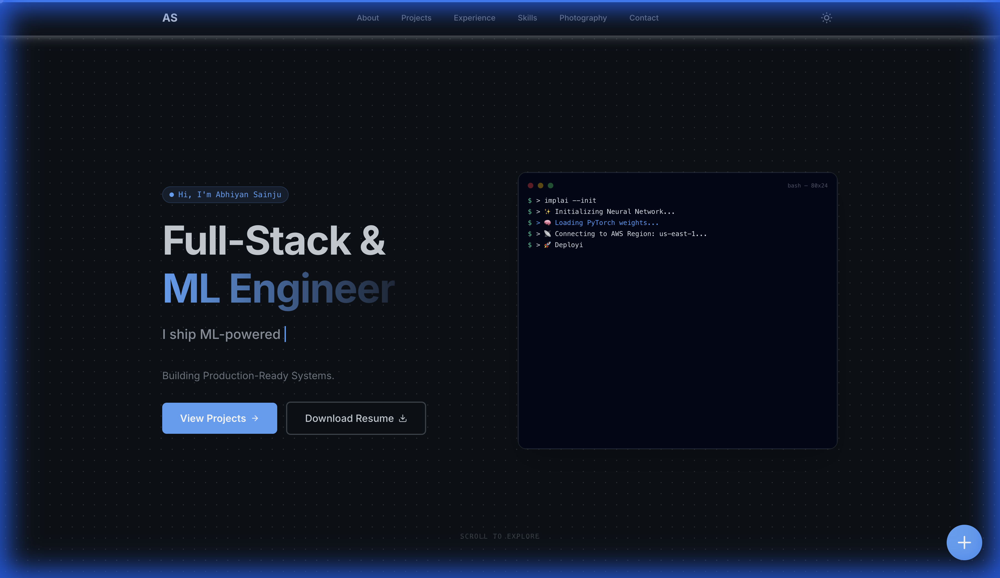
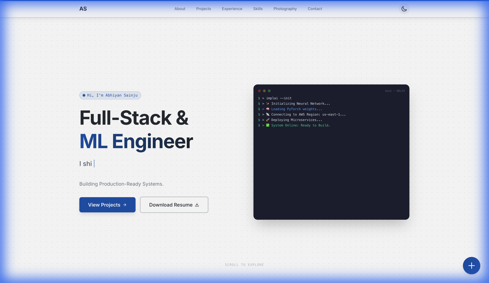
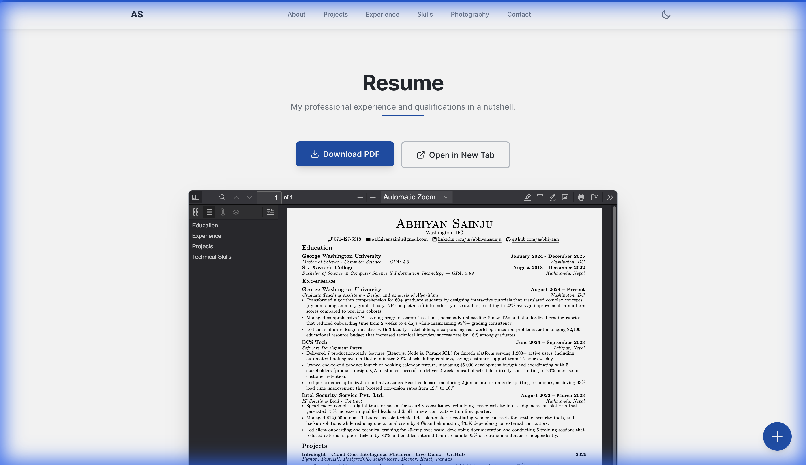
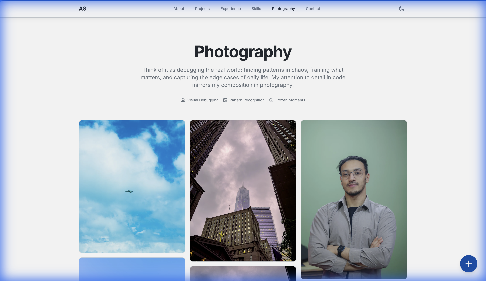
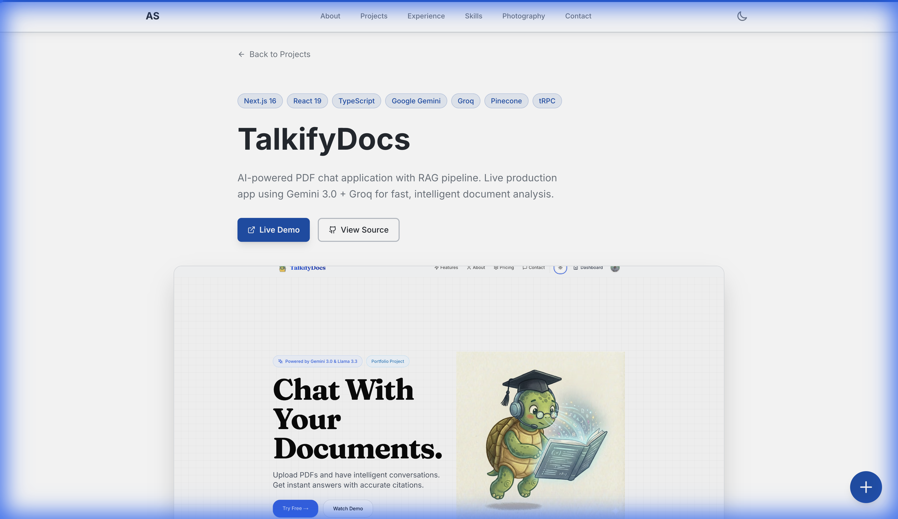

# Abhiyan Sainju - Portfolio

A high-performance, engineer-focused portfolio website built with **React 19**, **Vite 7**, and **Tailwind CSS 4**. Designed with a "Strict Professionalism" philosophy, featuring a live terminal interface, bento grid layout, and comprehensive project showcases.



## 🎯 Live Portfolio

**Visit:** [https://www.abhiyansainju.com](https://www.abhiyansainju.com)

---

## ✨ Screenshots

### 🌓 Theme Support (Dark & Light Mode)

<table>
<tr>
<td width="50%">

**Dark Mode**


</td>
<td width="50%">

**Light Mode**



</td>
</tr>
</table>

###  Resume Viewer

Embedded PDF viewer with download and new tab options:



###  Photography Gallery

Responsive masonry gallery preserving original aspect ratios:



###  Project Case Studies

Detailed project breakdowns with metrics and technical deep dives:



---

##  Key Features

###  Engineering First
- **Terminal Hero Interface**: A live, typing terminal component (`TerminalCard.tsx`) demonstrating CLI proficiency and system architecture skills
- **Bento Grid Layout**: A static, high-performance grid layout (`HeroBento.tsx`) for immediate visual impact without cognitive overload
- **Technical Case Studies**: In-depth project analyses with architecture diagrams, metrics, and technical challenges

###  Professional Resume Integration
- **Embedded PDF Viewer**: Dedicated `/resume` page allowing recruiters to view the resume directly in-browser
- **Smart Actions**: One-click download and "Open in New Tab" functionality
- **Multiple Versions**: Role-specific resumes (Full-Stack, ML, Backend, Cloud, Data Engineering)

###  Modern Design System
- **Strict Professionalism**: "High-Signal / Low-Noise" content strategy
- **Lucide Icons**: Consistent, lightweight iconography throughout
- **Glassmorphism & Gradients**: Subtle, premium UI elements using `backdrop-blur` and semantic tokens
- **Dark/Light Mode**: Fully theme-aware with persistent user preferences

###  Engineering & Art
- **Photography Integration**: Photography showcased as complementary texture, not a dominant element
- **EXIF Data Display**: Authentic camera settings and metadata
- **Optimized Images**: WebP format with automated optimization scripts

### ⚡ Performance Optimized
- **Lightning Fast**: Vite 7 for near-instant HMR and optimized production builds
- **Code Splitting**: Automatic route-based code splitting
- **Lighthouse Score**: Excellent performance metrics (check `lighthouse-desktop.json`)

---

## 🛠 Tech Stack

| Category | Technologies |
|----------|-------------|
| **Core** | React 19, TypeScript, Vite 7 |
| **Styling** | Tailwind CSS 4, CSS Variables (Semantic Theming) |
| **Animation** | Framer Motion 12 (Orchestrated entrance animations) |
| **Icons** | Lucide React |
| **Tooling** | ESLint, Prettier, Husky (Git Hooks) |
| **Deployment** | [Add your deployment platform] |

---

## ⚡ Quick Start

```bash
# Clone the repository
git clone [your-repo-url]
cd portfolio-abhiyan

# Install dependencies
npm install

# Start development server
npm run dev

# Build for production
npm run build

# Preview production build
npm run preview
```

The development server will start at `http://localhost:5173/`

---

## 📁 Project Structure

```
portfolio-abhiyan/
├── public/
│   ├── images/
│   │   ├── screenshots/        # Portfolio screenshots for README
│   │   ├── projects/           # Project images
│   │   └── photography/        # Photography gallery images
│   └── *.pdf                   # Resume versions
├── src/
│   ├── components/
│   │   ├── HeroBento.tsx       # Static grid layout for Hero section
│   │   ├── TerminalCard.tsx    # Live typing terminal component
│   │   ├── Navbar.tsx          # Navigation with theme toggle
│   │   ├── PhotographyGallery.tsx
│   │   └── ui/                 # Reusable UI components
│   ├── pages/
│   │   ├── Home.tsx            # Landing page with Bento Grid
│   │   ├── Resume.tsx          # PDF Viewer page
│   │   ├── Photography.tsx     # Photography gallery
│   │   ├── About.tsx           # About section
│   │   └── case-studies/       # Individual project case studies
│   ├── data/
│   │   ├── Projects.ts         # Centralized project data
│   │   └── Articles.ts         # Article metadata
│   └── utils/
│       └── Motion.ts           # Centralized animation tokens
├── content/                    # Blog posts and marketing content
└── docs/                       # Additional documentation
```

---

## 🏗 Development Workflow

This project follows professional git workflow standards:

- **Feature Branches**: `feature/feature-name`
- **Atomic Commits**: Descriptive commit messages following Conventional Commits
- **Linting**: Automated pre-commit checks via Husky
- **Code Quality**: ESLint + Prettier for consistent code style

### Commit Message Convention

```
feat: Add new photography gallery filter
fix: Resolve resume PDF loading issue
docs: Update README with screenshots
style: Improve dark mode contrast
refactor: Optimize terminal animation performance
```

---

##  Project Highlights

### TalkifyDocs
- **AI-powered PDF chat application** with RAG pipeline
- **Live Production App** using Gemini 3.0 Flash + Groq
- 50ms response time, handles 100+ page documents

### InfraSight
- **Real-time cloud infrastructure monitoring** platform
- Multi-cloud dashboard (AWS, Azure, GCP, Kubernetes)
- Custom REST API wrapper for unified metrics

### Audio Classification Network
- **ESC-50 audio classification** achieving 90.5% accuracy
- Custom CNN architecture with mel-spectrogram preprocessing
- Research-grade implementation with published results

> See [case studies](./src/pages/case-studies) for detailed technical breakdowns

---

##  Design Philosophy

### Strict Professionalism
- **High Signal-to-Noise Ratio**: Every element serves a purpose
- **Data-Driven Metrics**: Quantifiable achievements prominently displayed
- **Engineering Focus**: Technical depth over marketing fluff

### User Experience
- **Instant Load Times**: Optimized assets and code splitting
- **Accessibility**: ARIA labels, keyboard navigation, screen reader support
- **Responsive Design**: Mobile-first approach, tested across devices

---

## 📈 Performance

```bash
# Run Lighthouse audit
npm run lighthouse

# Results stored in lighthouse-desktop.json
```

Current metrics:
-  Performance: [Add your score]
- ♿ Accessibility: [Add your score]
- ✅ Best Practices: [Add your score]
- 🔍 SEO: [Add your score]

---

##  Contributing

While this is a personal portfolio, suggestions and feedback are welcome!

See [CONTRIBUTING_GUIDE.md](./CONTRIBUTING_GUIDE.md) for contribution guidelines.

---

## 📝 Documentation

Additional documentation available:
- [**PORTFOLIO_OVERVIEW.md**](./PORTFOLIO_OVERVIEW.md) - Comprehensive portfolio content details
- [**PROJECT_GUIDE.md**](./PROJECT_GUIDE.md) - Development guide and architecture
- [**CHANGELOG.md**](./CHANGELOG.md) - Version history and updates
- [**NEW_FEATURES_PLAN.md**](./NEW_FEATURES_PLAN.md) - Upcoming features roadmap

---

## 📄 License

**Proprietary** - © 2025 Abhiyan Sainju. All rights reserved.

This portfolio is the intellectual property of Abhiyan Sainju. Unauthorized copying, distribution, or use of this code is strictly prohibited.

---

##  Contact

- **Portfolio**: [https://www.abhiyansainju.com](https://www.abhiyansainju.com)
- **Email**: Contact via portfolio
- **LinkedIn**: [LinkedIn Profile](https://linkedin.com/in/abhiyansainju)
- **GitHub**: [@aabhiyann](https://github.com/aabhiyann)

---

<div align="center">

**Built with ❤️ using React, Vite, and modern web technologies**

⭐ Star this repo if you find it helpful!

</div>
